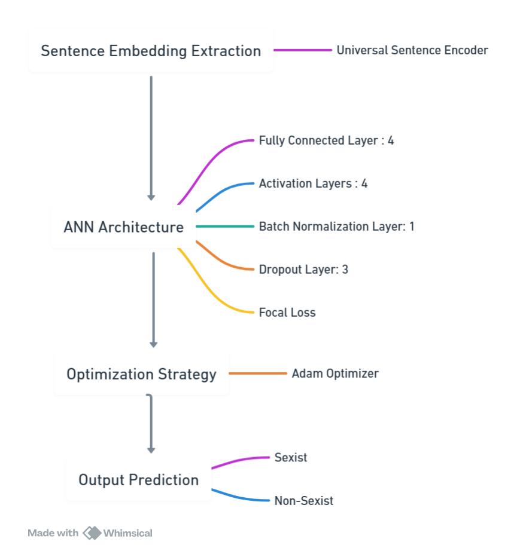
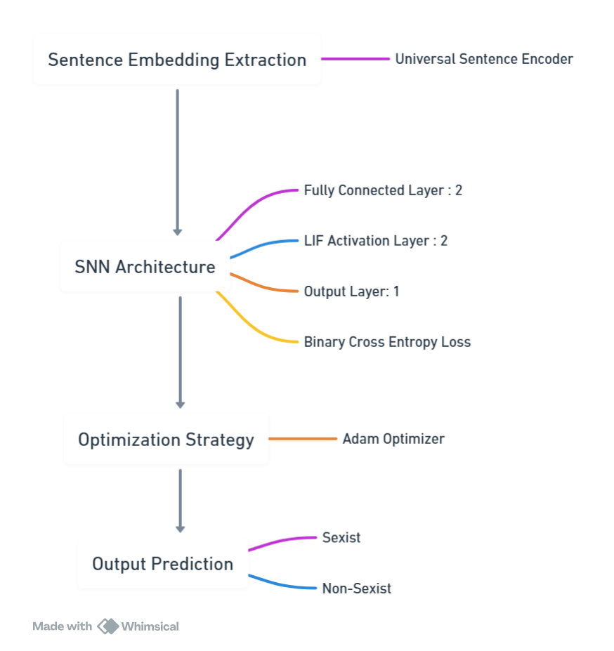
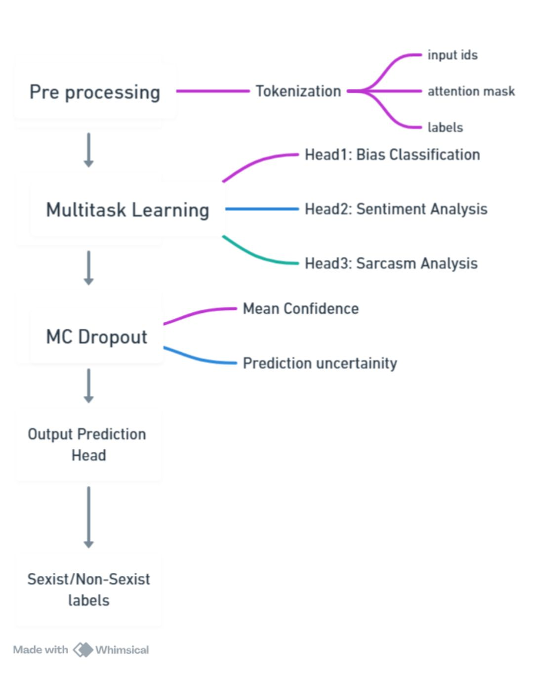
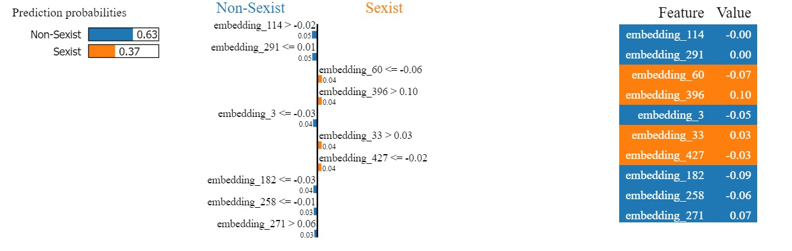
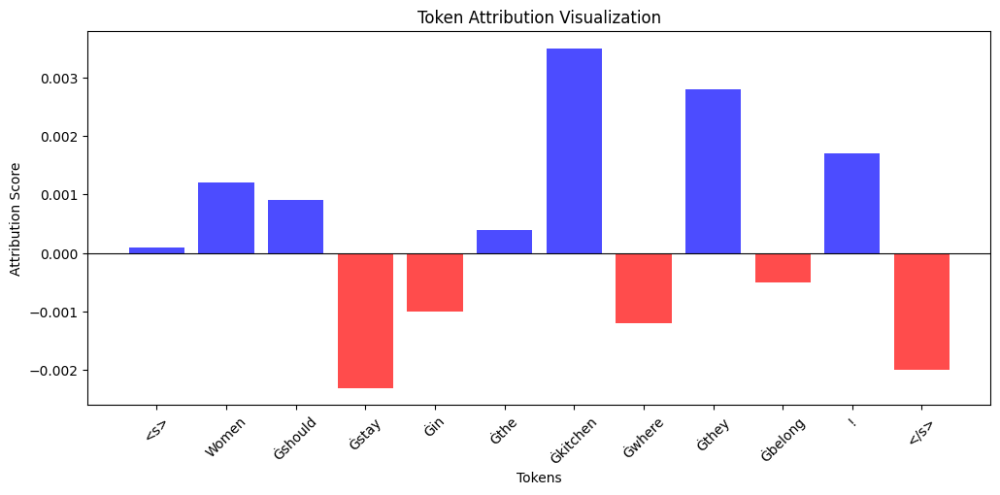

# Detecting Sexism in Text: Integrating Explainable AI and Contextual Intelligence

## Project Overview

This project focuses on detecting sexism in text using a combination of deep learning, spiking neural networks, and transformer-based models, enhanced with explainability techniques. It aims to address the challenge of identifying gender bias in textual data, which is critical for promoting fair and ethical AI systems.

### Key Features:

* Multi-model approach including Artificial Neural Networks (ANN), Spiking Neural Networks (SNN), and BERT-based transformers.
* Explainability integration using LIME, SHAP, and Integrated Gradients.
* Contextual intelligence for improved bias detection, incorporating sentiment and sarcasm as features.
* Real-world deployment with API integration and interactive user interface.

## Table of Contents

1. [Introduction](#introduction)
2. [Motivation](#motivation)
3. [Literature Review](#literature-review)
4. [Methodology](#methodology)

   * Data Preprocessing
   * Feature Extraction
   * Model Development
   * Integrating Explainability
5. [Deployment and Application](#deployment-and-application)
6. [Future Work and Improvements](#future-work-and-improvements)

## Introduction

Artificial intelligence (AI) has transformed natural language processing (NLP) by enabling automated analysis of large text corpora. However, the presence of bias in textual data remains a critical concern, leading to discriminatory outcomes if left unchecked. This project addresses the challenge of detecting sexism in text, combining the power of deep learning and contextual intelligence with explainable AI to improve transparency and trust.

## Motivation

Bias in textual data can significantly impact automated decision-making systems, leading to unintended discrimination and reinforcing harmful stereotypes. This project aims to develop reliable detection mechanisms for identifying sexist language, leveraging AI's ability to detect subtle biases often missed by manual review methods.

## Literature Review

This project builds on prior research in bias detection, leveraging advances in transformer models like BERT, as well as explainability techniques such as LIME and SHAP to enhance model transparency. Key challenges addressed include the detection of implicit biases, sarcasm, and context-dependent sexism.

## Methodology

### Data Preprocessing

* Text cleaning: Removal of URLs, hashtags, mentions, HTML tags, and emojis.
* Tokenization using BERTweet-Large for social media data.
* Handling class imbalance using strategic sampling techniques.

### Feature Extraction

* Universal Sentence Encoder (USE) for dense sentence embeddings (512 dimensions).

### Model Development

* **Artificial Neural Network (ANN)**: Deep feedforward network using USE embeddings with dropout and batch normalization.

* **Spiking Neural Network (SNN)**: Neuromorphic architecture with Leaky Integrate-and-Fire (LIF) neurons for energy-efficient processing.

* **BERT-based Model**: Fine-tuned BERTweet-Large for multi-task learning (bias classification, sentiment analysis, sarcasm detection).

### Integrating Explainability

* **ANN and SNN**: LIME for local interpretability.

* **BERT-based Model**: Integrated Gradients for token-level attribution.

## Deployment and Application

* Containerized deployment using Docker for cross-platform compatibility.
* API integration with FastAPI for real-time inference.
* Front-end developed with React.js for user-friendly interaction.
* Real-world use cases include social media moderation, corporate HR tools, and legal text analysis.

## Future Work and Improvements

* Improved handling of context-dependent bias, including sarcasm and implicit associations.
* Exploration of multimodal approaches (e.g., text and image data) for richer bias detection.
* Enhanced uncertainty quantification for more reliable predictions.

